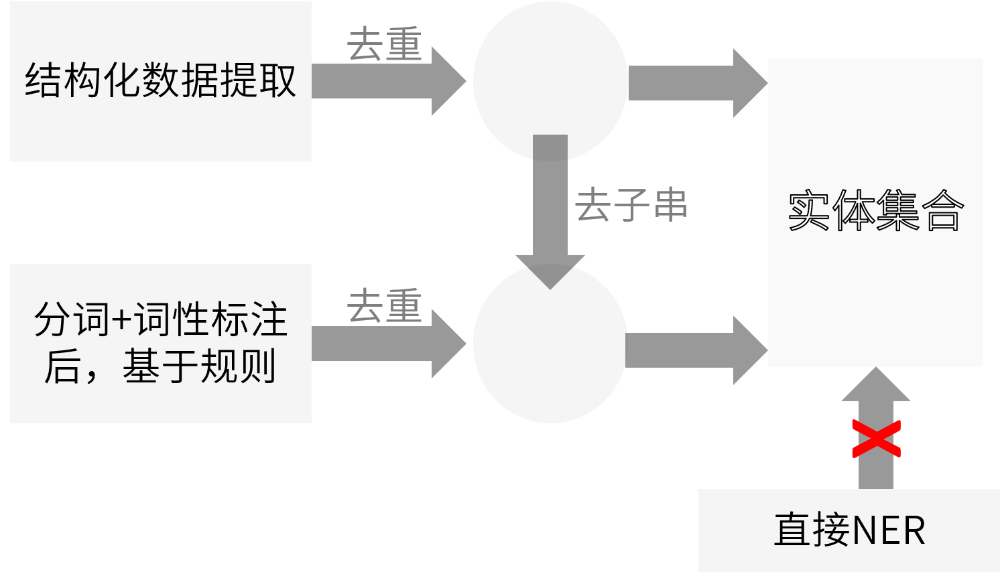

# BDCI-2017：基于机构实体的智能摘要和风险等级识别 [](http://github.com/badges/stability-badges)
> 本队队名是“+1s”。初赛成绩为40/230，复赛成绩是A榜13/230，B榜17/230
### [项目幻灯片](http://slides.com/pzoom/deck-1/fullscreen)
## 1 题目回顾
为了通过大数据及人工智能助力金融机构更好的控制风险，推动社会诚信的发展，法海风控作为全球领先的数据服务提供商，在2017年CCF大数据与计算智能大赛（BDCI）上提出[赛题](www.datafountain.cn/#/competitions/269/intro)，要求根据新闻数据集，提取出正文中的主要机构实体，并生成智能摘要（核心需求为判断风险等级）。其中，风险等级分三类：正向、负向、中性；疑似经营风险、虚假宣传、司法风险等都判定为负向；新产品问世、通过质量认证等都判定为正向。本文介绍了面向这项需求的一种解决方案。在本方案里，我们以特征工程为核心，及多角度复合型规则筛选器为核心模块，辅以基于Stanford Corenlp工具包等机器学习手段，实现了较高精度的机构实体识别，并给出了具有一定潜力的风险等级（极性）判定方法。
### 1.1 任务描述
对数据集中的每条记录，提取出正文中的主要机构实体，并生成智能摘要。同一篇新闻中，不同的机构实体，对应的关键词、风险等级和摘要可能不同。作为示例，针对这段新闻，我们可以给出对应的输出表：
> 某某网1月19日文：1月19日消息，北京知识产权法院就搜狐视频诉北京暴风科技股份有限公司（以下简称“暴风公司”）网络剧作品《高品格单恋》信息网络传播权侵权二审一案，做出终审判决，搜狐视频终审胜诉，认定暴风公司主观恶意程度较高，构成直接故意侵权，判决暴风公司赔偿搜狐视频经济损失及合理费用共计125,000元。
……

|机构实体|摘要（简明扼要，尽量不超过100字）|关键词|风险等级|
|:--|:--|:--|:--|
|搜狐视频|搜狐视频终审胜诉暴风公司|终审、胜诉|正向|
|暴风公司|暴风公司侵权，赔偿搜索视频125,000元|侵权、赔偿、125,000元|负向|
|北京知识产权法院|北京知识产权法院做出终审判决|终审、判决|中性|

### 1.2 数据说明
本赛题的数据集为法海风控采集的司法、财经、科技、质量监督类，由权威媒体发布的新闻舆情数据。赛题提供方从原始网页中提取了标题、正文、发布时间等内容，组织成JSON格式。具体文件清单及说明如下：
- [DATA_T.txt](dataset/DATA_T.txt)：训练数据集
- [DATA_T_RESULT.txt](dataset/DATA_T_RESULT.txt)：训练数据集参考结果
- [NEGATIVE_WORDS.xls](dataset/NEGATIVE_WORDS.xls)：正负面词汇供参考
- [DATA_TEST.txt](dataset/DATA_TEST.txt)：测试数据集

格式方面，训练与测试用文本文件，每行一条记录，\r\n 为换行符；每行为一个JSON格式数据，详细字段定义见下表：

|字段|类型|名称|备注|
|:--|:--|:--|:--|
|newsId|Text|标识ID||
|srcUrl|text|来源链接|部分链接可能失效|
|title|text|标题||
|postTime|long|发布时间|时间戳-毫秒|
|body|text|正文|包含标签|

### 1.3 评分方法

按 “准确度\*系数” 的方式来评分，满分100。
```c
得分=（用户负向/标准负向）*50+（用户正向/标准正向）*30+（用户中性/标准中性）*20
系数= 用户识别实体数量/标准实体数量 （小于1时为1，超出1.3倍以后，数量越大，值越小）
```
## 2 设计与实现
### 2.1 清洗与预处理
#### 2.1.1 数据观察
为了方便观察实验数据，我们使用[JSON to CSV Converter](https://json-csv.com/)将数据集中的信息结构化信息转为了表格，便于观察。我们发现，赛题的训练集标注质量不高。其中比较明显的问题包括：
- 实体不全。大量的机构实体没有被发现并列出；
- 新闻与摘要/关键词不对应。部分新闻正文与实体列表完全或者部分不对应；
- 地名取舍不一致。部分新闻中，机构实体会含有地名前缀，而另一部分新闻中，并没有纳入地名前缀；
- 摘要敷衍，关键词缺失严重。
由于上述问题，我们判断机器学习在本问题中可能会引入较大误差。因此，我们只在数据预处理阶段，对新闻正文、训练集实体域进行分词与词性标注时引入机器学习技术，以便开展后续工作。
#### 2.1.2 分词与词性标注
在数据预处理阶段，我们对新闻正文、训练集实体域进行了分词与词性标注，以便开展后续工作。得到的结果结构如下所示：
```json
{
  "sentences":[
    {
      "index":,
      "tokens":[
        {
          "index":,
          "word":,
          "originalText":,
          "lemma":,
          "characterOffsetBegin":,
          "characterOffsetEnd":,
          "pos":,
          "ner":,
        },
        ...
      ]
    },
    ...
  ]
}
```
### 2.2 面向赛题的机构实体识别
#### 2.1.1 基于命名实体识别(NER)
一种较为直接的思路，是直接使用相关的分词工具包对测试集的正文部分进行提取。完成该过程后，去除其中的非目标机构实体（如新闻正文的来源媒体等）与重复的实体，得到相应实体列表；
#### 2.1.2 基于成词模式
预处理阶段，我们取得了训练集实体域的分词与词性标注结果。我们对其进行了统计，发现目标输出实体具有一定的常见模式。通过对具体词汇与词性模式建立规则，我们可以提取出大量的机构实体；
#### 2.1.3 基于结构化数据提取
数据集中，大量的新闻中含有表格。因此，数据集的正文域可以作为一种半结构化文本进行处理。<br>
首先，我们以序号作为标志物，将文本分割。若序号连续且分割得到的片段在结构上相同，则判定为表格提取后存入对应的数据结构。对得到的表格的每个单元进行扫描，若认定其中的任一单元为机构实体，则其所在的列均可认定为机构实体。
### 2.3 面向赛题的风险等级判定
#### 2.3.1 “政府”类机构
所谓的“政府类”机构，指以“国家”、“中国”等特定词作前缀或以“研究所”、“检测局”等词作后缀的实体。通过对训练集的观察，我们认为这部分实体可以直接判定为中性极性；
#### 2.3.2 其余机构
其余的机构根据来源不同，有着不同的风险等级判定方法。对于基于结构化数据提取的词语，我们将在它们对应的表格行中提取风险等级；如果对应表格行中不具有极性，我们考虑从整张表的整体极性出发进行判定。对于其它的直接来自原始文本的实体，我们将通过上下文来获取风险等级信息。
## 3 实验与结果
我们采用的自然语言处理工具包为Stanford CoreNLP。在进行词性标注时，选取的语料库为Penn Treebank(PTB)。
### 3.1 命名实体识别
我们基于NER直接采集了标注为ORGANIZATION的实体。这种方法的优点是全自动，但是质量极低。<br>
我们扫描分词结果，利用预处理得到的成词模式进行模式匹配，获取实体。直接得到的结果数量相对直接NER有所增多，但是质量仍然不能令人满意。主要问题是由于词性标注(POS)寻词时难以考虑语义信息，出现了大量粘连或过短的实体。因此，我们在初步结果基础上，人工确定规则以进行切割与过滤。<br>
我们通过提取结构化数据，也得到大量实体。这部分实体的质量极高，但是数量相对有限。
### 3.2 风险等级判定
我们首先通过前后缀匹配，扫描获得每条新闻中的“政府类”实体，将它们的极性全部置为中性。<br>
对于其它的实体，处理方式与来源具有强依赖性：对于来源为提取出的结构化文本的实体，我们首先利用情感词典匹配，试图在同一行确定极性；如果不能确定，则会返回到全表，在表头处匹配情感词。对于来源为原始文本的实体，我们会在上下文进行情感词匹配，如果匹配无效，则会返回全文情感。
### 3.3 结果整合与对比
在数据清洗与预处理阶段，我们注意到训练集中摘要敷衍且关键词缺失严重的现象。通过在评测阶段的提交，我们发现这两个域并没有参与最终的评分。因此，在结果结合阶段，我们主要关注实体域和极性域。<br>
在整合得到最终实体列表时，我们发现基于NER直接获得的机构实体识别B质量最差。考虑到机构实体识别C的生成过程中已经吸收了前者的信息，同时实体过量会导致得分降低（通过在A榜阶段“试榜”，我们估计最优实体数量约为21100条）。因此，我们从上述三个来源的质量出发，决定以结构化数据为主，基于规则得到的实体为辅，按照下图的逻辑进行整合：

在整合风险等级的实际操作中，由于负向极性在目标函数里拥有更大的系数，我们在难以确定极性时，统一置为了负向。<br>
我们各个提交版本的评分情况如下

|实体抽取方法|极性判定方法|评分|
|:--|:--|:--|
|直接采用Stanford CoreNLP工具包|基于语境判定|约15分|
|直接采用Stanford CoreNLP工具包|全部置为负向|约17分|
|NER+基于成词模式（后缀）|二分类后判定|约21分|
|结构化抽取+基于成词模式|通过判定模块，更细粒度|约36分|

## 4 总结
本文提出了一种面向需求的基于机构实体的智能摘要和风险等级识别方案。该方案充分利用了数据集所具有的特征，很好地完成了相关机构实体的抽取，较好地判定了相应的风险等级。但是，由于迭代周期的限制，本方案仍有部分数据未进行充分利用，在极性判定方面尚存在较大的提高空间，同时具有引入更多模式与工具以提升性能的可能性。本文所探讨的模式对于同类任务具有相当高的参考与借鉴价值。
#### 参考文献/工具
[1]Manning, Christopher D., Mihai Surdeanu, John Bauer, Jenny Finkel, Steven J. Bethard, and David McClosky. 2014. The Stanford CoreNLP Natural Language Processing Toolkit In Proceedings of the 52nd Annual Meeting of the Association for Computational Linguistics: System Demonstrations, pp. 55-60.<br>
[2]Pi-Chuan Chang, Huihsin Tseng, Dan Jurafsky, and Christopher D. Manning. 2009. Discriminative Reordering with Chinese Grammatical Relations Features. In Proceedings of the Third Workshop on Syntax and Structure in Statistical Translation.<br>
[3]Kristina Toutanova, Dan Klein, Christopher Manning, and Yoram Singer. 2003. Feature-Rich Part-of-Speech Tagging with a Cyclic Dependency Network. In Proceedings of HLT-NAACL 2003, pp. 252-259.<br>
[4]Jenny Rose Finkel, Trond Grenager, and Christopher Manning. 2005. Incorporating Non-local Information into Information Extraction Systems by Gibbs Sampling. Proceedings of the 43nd Annual Meeting of the Association for Computational Linguistics (ACL 2005), pp. 363-370.<br>
[5]	Xue, Nianwen, et al. Chinese Treebank 8.0 LDC2013T21. Web Download. Philadelphia: Linguistic Data Consortium, 2013.
> 如果有任何问题或建议，欢迎通过issue提出。
